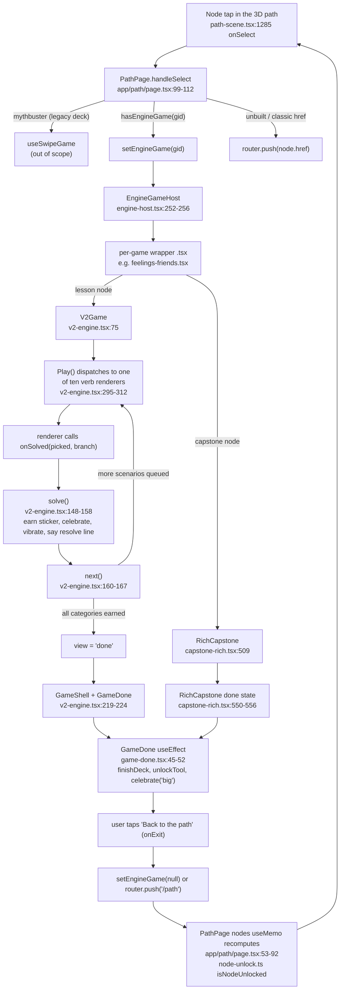

# SwipeEd v2 engine

## Overview

SwipeEd's path has 77 nodes: 69 lesson games (`g01`-`g69`) across 8 age-band chapters plus 8 chapter-closing
capstones (`c1`-`c8`). Every lesson node renders through one shared component, `V2Game`
(`src/components/games/v2-engine.tsx:75`), and every capstone renders through a second shared component,
`RichCapstone` (`src/components/games/capstone-rich.tsx:509`). Both are "mechanic-embodying": a game is not a
quiz with a skin, it is a typed scenario library (`src/content/games/<id>.ts`) played back through one of ten
play verbs defined in `src/content/games/v2-schema.ts:13` (`reflect`, `role-play`, `strike-rewrite`, `branch`,
`sort`, `match`, `build`, `explore-label`, `spot`, `swipe`), so the interaction itself is the lesson (drag a
chip to sort it, scrub a myth to erase it, swipe a flag to read it) rather than a proxy tap on a multiple-choice
option.

Each of the 69 lesson wrapper components (for example `src/components/games/feelings-friends.tsx`) is a thin,
mostly-comment file that imports its game's config and renders `<V2Game config={THE_CONFIG} onExit={onExit} />`.
Each of the 8 capstone wrappers (for example `src/components/games/capstone-1.tsx`) is the same shape around
`<RichCapstone config={THE_CONFIG} onExit={onExit} />`. Depth lives entirely in content; the two engine files
plus their shared support files are the whole runtime.

This doc covers only the v2 engine (lesson games) and the rich capstone engine (chapter graduations). SwipeEd
also ships a separate, older "swipe deck" system (`src/lib/use-swipe-game.ts`, `src/lib/use-run-game.ts`,
`src/lib/scoring.ts`, `src/lib/run-scoring.ts`, driven by `Card`/`Fork` content in `src/content/decks.ts` and
`src/content/runs.ts`) that still powers the Quick Play `mythbuster` deck and the classic/run views. It predates
the v2 unification, is not part of the ten-verb schema, and is out of scope here; it is mentioned only where it
explains why a file such as `src/lib/scoring.ts` exists but is not used by `V2Game`.

The question-bank content format and the forge content pipeline that generates and gates scenario libraries are
covered in the [question bank](../schemas/question-bank.md) doc; this doc treats `src/content/games/v2-schema.ts` only as far as the engine consumes it.

## Lifecycle: path node to GameDone

Step by step, with the files that own each hop:

1. **Node tap.** `PathScene` (`src/components/path-scene.tsx:2124-2134`) renders each node and, on tap, calls its
   `onSelect` prop (wired through `Node`, `path-scene.tsx:1285`) with the tapped `SceneNode`.
2. **Routing the tap.** `PathPage.handleSelect` (`src/app/path/page.tsx:99-112`) reads `node.game`: the
   `mythbuster` id goes to the legacy swipe engine; anything for which `hasEngineGame(gid)` is true (from
   `engine-host.tsx`) sets `engineGame` state, which mounts `EngineGameHost`; anything else (an unbuilt "soon"
   node, or a node whose only affordance is a plain route) falls back to `router.push(node.href)`.
3. **Registry lookup.** `EngineGameHost` (`src/components/games/engine-host.tsx:252-256`) looks up the game id in
   the `GAMES` map and renders that wrapper component with `onExit`.
4. **Wrapper to engine.** The wrapper (one of the 69 lesson files, or one of the 8 capstone files) renders either
   `V2Game` or `RichCapstone` with its game's typed config.
5. **Play loop.** Inside `V2Game`, `Play()` (`v2-engine.tsx:295-312`) switches on the current scenario's `type`
   and renders the matching verb renderer. The renderer's only contract back to the engine is calling
   `onSolved(picked?, branch?)` when the child completes the interaction; there is no fail path.
6. **Resolve and advance.** `solve()` (`v2-engine.tsx:148-158`) marks the scenario's category earned, fires a
   small celebration and haptic, and speaks the resolve line (or, for `strike-rewrite`, shows the shared UN/RE
   card). `next()` (`v2-engine.tsx:160-167`) either presents the next queued scenario or, once every category has
   been earned, switches the view to `"done"`.
7. **Completion.** The `"done"` view wraps `GameDone` in `GameShell` (`v2-engine.tsx:219-224`; the equivalent for
   capstones is `capstone-rich.tsx:550-556`). `GameDone`'s mount effect (`game-done.tsx:45-52`) writes the
   completion into the shared profile once: `finishDeck(gameId, stars, coins, bestStreak)`, then
   `unlockTool(id, level)` for any Life-Skills Toolkit tool the game grows, then a big celebration.
8. **Back to the path.** `onExit` either clears `engineGame` state (in-place play on `/path`) or
   `router.push("/path")` (the standalone `/game/[id]` route, `src/app/game/[id]/page.tsx:32`). Either way,
   `PathPage`'s `nodes` memo (`app/path/page.tsx:53-92`) recomputes from the now-updated `profile.deckStars`, and
   `src/lib/node-unlock.ts`'s `isNodeUnlocked` (`node-unlock.ts:36-42`) may flip the next node from `locked` to
   `playable` because its `prereq` is now satisfied.

## Registry and how a game is added

`engine-host.tsx` is a single hand-written object, `GAMES: Record<string, EngineGame>`
(`engine-host.tsx:10-245`), mapping every one of the 77 game ids to a `next/dynamic(() => import("@/components/
games/<file>").then((m) => m.<Component>))` call. It is a closed, compile-time map: there is no runtime
plugin loading or external manifest, the import specifiers are string literals resolved at build time, and an id
not in the object simply renders nothing (`hasEngineGame`, `engine-host.tsx:247-249`). Both lesson wrappers and
capstone wrappers are registered the same way; capstone entries just happen to all resolve to the same
`RichCapstone` component under different configs (compare `capstone-1.tsx` and `capstone-8.tsx`, both of which
are a two-line wrapper around `RichCapstone` with a different `config` import).

Adding a game touches, at minimum:
1. `src/content/games/<id>.ts`: the typed `V2GameConfig` (scenarios, categories, badge, optional `helpLine`).
   `gameId` must equal both the path node's `game` field and the `engine-host.tsx` registry key
   (`v2-schema.ts:60`: "DO NOT RENAME").
2. `src/components/games/<id>.tsx`: the wrapper, `<V2Game config={...} onExit={onExit} />`.
3. One new entry in `engine-host.tsx`'s `GAMES` map.
4. Regenerating `src/content/path.ts` from `scripts/master-node-table.xlsx` via `scripts/gen-path.py` (not part
   of the runtime engine, but the path won't show a new node without it).

`scripts/swipeed_status.py` enforces step 3 at the repo level: it parses `engine-host.tsx`
(`swipeed_status.py:22`, `ENGINE_HOST`) and flags any node that is built to v2 but missing from the registry as a
blocking problem (`swipeed_status.py:127,130`: "is built v2 but is NOT registered in engine-host (won't launch)").

Adding an eleventh mechanic is a different, larger job, because the mechanic set is a closed union rather than a
registry. See [Fail-closed guards](#fail-closed-guards) below for what now catches a half-finished attempt, and
[Extending SwipeEd](../games/extending-swipeed.md) for the full multi-file checklist (content schema, forge
pipeline, workflow scripts) beyond the two app files this doc covers.

## The verbs

Every verb renderer lives in `src/components/games/v2-engine.tsx` and is reached only through the `Play()`
switch (`v2-engine.tsx:295-312`), which the compiler now enforces is exhaustive (see
[Fail-closed guards](#fail-closed-guards)). There are eleven since `choose` joined on 2026-09-15. All share the same outer
contract: no hard fail state, a wrong attempt is a spoken nudge and a retry, and the renderer's only way to finish is calling `onSolved`.

| Verb | What the child does | Input modes | Feedback / UN-RE | Renderer (file:line) |
|---|---|---|---|---|
| **reflect** | Taps any one of several options; every option is valid (no wrong answer) | Tap only, native buttons | Picked option echoed back by name, then the shared `affirm` line; no UN/RE beat | `ReflectPlay`, `v2-engine.tsx:405-413` |
| **choose** | Taps every option that fits out of six (two to four fit), then Check | Tap only; options are checkbox buttons | A first Check that misses says how many fit and allows a retry; the next Check reveals every answer with notes for wrong and missed picks, then resolves (no-fail). `V2Game` keeps the renderer mounted through the resolve so the answers stay visible above the `relearn` pill ([SWED-69](https://app.plane.so/the-equal-lens/projects/59d0b01f-352e-4aee-bd3f-252cdf283a74/issues/80b520f8-46da-4703-82e7-0921d6d1ffa4)) | `ChoosePlay`, `v2-engine.tsx` |
| **role-play** | Taps one of two shuffled "say it" speech cards; only the assertive line advances | Tap only, native buttons | Passive pick: spoken nudge, card set stays up for a re-pick; no UN/RE beat | `RolePlayPlay`, `v2-engine.tsx:419-436` |
| **strike-rewrite** | Scrubs back-and-forth across the myth card to erase it | Drag/scrub (`usePointerDrag`, distance-based), or Enter/Space on the focusable card | The one verb with a dedicated UN/RE moment: resolve renders the shared `UnReBeat` card (`un-re.tsx`). In a game with `mythCards` on, `present()` plays about half the beats as a myth card instead: the card shows `myth.un` (swipe Myth) or `myth.re` (swipe True), a wrong side nudges, and the resolve is the same UN/RE card ([SWED-70](https://app.plane.so/the-equal-lens/projects/59d0b01f-352e-4aee-bd3f-252cdf283a74/issues/f9b2ee4c-8681-47c0-bc98-fa7fefd55543)) | `StrikePlay`; `MythCardPlay` on the shared `SwipeCard` |
| **branch** | Taps one of several shuffled choices and sees its consequence; only the `best` choice (or any, if none is marked best) advances | Tap only, native buttons | Consequence spoken on pick; advancing pick shows a 💚/💛 emoji-prefixed consequence (see SWED-57); no UN/RE beat | `BranchPlay`, `v2-engine.tsx:466-496` |
| **sort** | Drags a chip into its labelled bin | Drag (`usePointerDrag` + `hitTestZone`), or tap-to-arm chip then tap bin | Spoken confirmation per correct placement; wrong bin springs back with a nudge; items and zones are both shuffled; no UN/RE beat | `SortPlay`, `v2-engine.tsx` |
| **match** | Draws a cord from a left card to its right card | Drag (`usePointerDrag` + `hitTestZone` + `ConnectorOverlay`), or tap-left then tap-right | Spoken confirmation per correct pair; wrong pair springs back with a nudge; no pair sits straight across; no UN/RE beat | `MatchPlay` wraps the shared `MatchBoard`, `src/components/games/match-board.tsx` |
| **build** | Drags (or taps) pieces onto a "slate", then confirms | Drag (`usePointerDrag` + `hitTestZone`) with a tap fallback; explicit confirm button | Spoken nudge on a wrong/out-of-order piece; no UN/RE beat | `BuildPlay`, `v2-engine.tsx:684-729` |
| **explore-label** | Taps the body part on a figure (anatomy content) or the correct "which is true" card (abstract content) matching a clue | Tap only, native buttons (anatomy variant positions them over an `aria-hidden` SVG figure) | Wrong tap re-asks with a nudge; resolve speaks a `reveal` fact; no UN/RE beat | `ExploreLabelPlay`, `v2-engine.tsx:768-812` |
| **spot** | Taps every "trick" (red-flag) item in a scene; a scene can hide more than one | Tap only, native buttons | Spoken progress ("Caught one, N more"); wrong tap gets a warm nudge; resolve speaks `why`; no UN/RE beat | `SpotPlay`, `v2-engine.tsx:816-851` |
| **swipe** | Drags the cue card left or right past a threshold, or flicks it | Drag, Left/Right arrow keys on the focusable card, or the two side buttons under it | Card tints and shows an edge badge live, during the drag, toward the side being dragged; wrong side springs back with a nudge; the card ignores input once the right side is chosen; resolve speaks `relearn`; no UN/RE beat | `SwipePlay` wraps the shared `SwipeCard`, `src/components/games/swipe-card.tsx` |

Scoring is uniform across all ten verbs and is not per-answer: solving a beat calls `earn(sc.cat)`
(`v2-engine.tsx:144,150`, marks that scenario's category as "earned" for the sticker strip) and
`celebrate("small")`; there is no point value, streak, or wrong-answer penalty anywhere in `V2Game`. Completing
a whole game (every category earned) always awards a fixed **3 stars and 15 coins**
(`v2-engine.tsx:222`: `<GameDone gameId={gameId} stars={3} coins={15} .../>`), regardless of how many nudges the
child needed along the way. This is a deliberate departure from the older swipe-deck engine's accuracy-driven
`starsFor()` (`src/lib/scoring.ts:28-34`), which is why `scoring.ts` and `run-scoring.ts` are not imported by
`v2-engine.tsx` at all.

## Capstones and how they differ

`RichCapstone` (`capstone-rich.tsx:509-616`) plays back a fixed sequence built once per mount
(`capstone-rich.tsx:511-516`): an arrival beat, then one "victory lap" per `config.playback` entry, then one
`reflect` prompt per `config.reflect` entry, then a celebration. A `step` index (not `V2Game`'s
view+queue pair) walks that sequence; a `canNext` flag gates the bottom "Next" button until the current lap or
reflect prompt calls `onSolved` (`capstone-rich.tsx:535`).

Laps reuse nine of the ten v2 verb shapes (`gallery`, `match`, `sort`, `build`, `spot`, `swipe`, `branch`,
`strike-rewrite`, `role-play`; see `CapLap` in `src/content/games/capstone-schema.ts:31`); `explore-label` has no
capstone lap. `gallery` (`GalleryLap`, `capstone-rich.tsx:56-81`) is capstone-only: a "look back" recap where
tapping each chapter's flag replays its `bigTruth` line, with no v2-engine equivalent. `reflect` is present too,
but as a structurally separate step (`CapReflect`, not a `CapLap` variant) rendered by its own `ReflectView`
(`capstone-rich.tsx:468-483`), not `V2Game`'s `ReflectPlay`.

The important architectural fact: **capstone laps are not calls into the v2-engine renderers.** `MatchLap`,
`SortLap`, `BuildLap`, `BranchLap`, `StrikeLap`, `RolePlayLap`, `SwipeLap` and `SpotLap`
(`capstone-rich.tsx:84-448`) are independent reimplementations of the corresponding `v2-engine.tsx` renderers,
sharing only a few imported helpers (`binStyles`, `MATCH_TINTS` from `v2-engine.tsx`; `usePointerDrag`,
`hitTestZone`, `ConnectorOverlay` from `interactions.tsx`; `Sam`, `UnReBeat`, `GameShell`, `GameDone`, `speak`,
`celebrate`). This is tracked as SWED-60; see [Known issues](#known-issues).

Other differences from a lesson game: capstones award **3 stars and, by default, 25 coins**
(`capstone-rich.tsx:553`: `coins={config.coins ?? 25}`, versus 15 for a lesson game) and close with a
Life-Skills Toolkit reflection (`ToolkitReflection`, rendered from `game-done.tsx:99-105` for any `capstone-*`
id) on top of the shared `GameDone` card. A capstone is never gated and is replayable at any time; it records
completion the same way a lesson does, through `GameDone`'s `finishDeck` call.

## State and persistence

All profile state lives in one React context, `ProfileProvider`/`useProfile()`
(`src/lib/store.tsx:67-257`), backed by one `localStorage` key, `glrl.profile.v1`
(`store.tsx:22`, a pre-rebrand name that has not been renamed). The stored object is default-merged on load
(`store.tsx:74-75`: `{...DEFAULT_PROFILE, ...JSON.parse(raw)}`), so new profile fields need no storage
migration.

`V2Game` and `RichCapstone` touch only a narrow slice of this: they read `profile.name` and `ready` (for the
personalised greeting, `v2-engine.tsx:89-91`), and on completion they call, via `GameDone`:
- `finishDeck(gameId, stars, coins, bestStreak)` (`store.tsx:133-142`): adds `coins`, raises `bestStreak` to the
  max seen, and sets `deckStars[gameId]` to the max of its old value and `stars`. Because a v2 game or capstone
  always passes `stars: 3`, `deckStars` for these ids is effectively a completion flag rather than a graded
  score.
- `unlockTool(id, level)` (`store.tsx:164-173`) for each Life-Skills Toolkit tool the game grows
  (`toolsUnlockedBy(gameId)`, `src/lib/toolkit.ts`; a no-op for non-Thread-C games).

Node unlocking is derived, not stored: `src/lib/node-unlock.ts`'s `isNodeUnlocked` (`node-unlock.ts:36-42`) is a
pure function of a node's `prereq`, the player's `entryAgeGate`, and a completion test built from
`profile.deckStars` in `app/path/page.tsx:56-71`. `PathPage` recomputes this in a `useMemo`
(`app/path/page.tsx:53-92`) whenever `deckStars`, `runDeckCleared`, or `entryAgeGate` change, which is exactly
what happens the moment `finishDeck` runs.

A second, smaller piece of state is content rotation, not profile: a per-game anti-repeat ring at
`localStorage` key `swipeed:seen:<gameId>` (`v2-engine.tsx:60-66`), capped at roughly 60% of that game's bank
size, consulted by `chooseFresh` (`v2-engine.tsx:69-72`) so a session draws unseen scenarios first.

Calm Mode and mute are profile fields (`calmMode`, `muted`) that `store.tsx` mirrors one-way, on every change,
into module-level flags in `src/lib/juice.ts` (`store.tsx:92-102`: `setJuiceMuted`, `setJuiceCalm`, plus toggling
a `calm` class on `<html>`), so any code that calls `prefersReducedMotion()` or checks mute from `juice.ts`
directly sees the current profile setting without needing the store's React context.

## Question card, reveal and focus

Added by [SWED-66](https://app.plane.so/the-equal-lens/projects/59d0b01f-352e-4aee-bd3f-252cdf283a74/issues/368de34e-fae5-48bc-b229-6844dee0ca7e)
after a playtest where players answered without reading the question. The visual pattern is specified in
[design.md, How Lensy speaks](../design.md#voice-and-copy); this section is the engine side. Both engines render
`LensyQuestion` and `RevealGate` from `src/components/games/lensy-question.tsx`.

**Building the question.** `hookLine(s)` in `V2Game` returns the text for the card: `joinQuestion(hook, prompt)`
for `reflect` and `build`, `joinQuestion(hook, setup)` for `role-play`, `joinQuestion(hook, "Find <find>.")` for
`explore-label`, and `cleanLine(hook)` for every other mechanic. `cleanLine()` strips "Lensy:"/"Sam:" narrator
prefixes at the start of the line or of any sentence; `joinQuestion()` drops a prompt the hook already ends with
and drops a clipped tag question of up to three words that is not itself a question ("Agree?", "Land right?")
from the end of the hook when a real question follows. `say()` runs every spoken line through `cleanLine()` too.

**One beat, in order (`V2Game`).**

1. `present(s)` sets `question` to `hookLine(s)`, `revealed` to false and the phase to `"play"` in one batch
   with the new `qi`, then speaks the question.
2. `LensyQuestion` gets `focusKey = "<qi>:<scenario id>"`; its effect focuses the card `h2` (`tabIndex={-1}`,
   `preventScroll`) whenever the key changes, so focus and the new text land in the same commit.
3. While `revealed` is false the middle zone renders `RevealGate` instead of `Play`. An effect sets `revealed`
   after `revealDelayMs(question)` (1,200ms plus 60ms a word, at most 4,000ms). It is a timer, not speech
   `onEnd`, because `stopSpeaking()` cancels `onEnd` and muting mid-line would strand the answers. Tapping the
   card (`onTap`) or the gate reveals at once; the gate hands focus to the first answer on the next frame.
4. `Play` mounts inside an `animate-in` wrapper (no animation under reduced motion). Renderers call
   `say(t, shown?)`: `t` is spoken; the feedback line shows `shown` when given, else `t`. When the two
   differ (`shown` is `""` for a non-best branch pick, whose consequence card is already on screen) the
   spoken line is kept in `heard` and passed as `announce`, a `sr-only` span in the same live region.
5. On `solve()` the phase becomes `"resolve"`: the feedback line empties, `announce` carries the result
   (`"That's the best choice. "` plus the consequence for a best branch pick, otherwise the resolve line) and
   an effect focuses Next.

Replay ("Hear it again") speaks the question during play and the last line otherwise. The question's spoken
form is kept in `questionSpeech`, because a myth card's question card reads only "Myth or true? Swipe the card."
while Lensy also reads out the card.

**Myth cards ([SWED-70](https://app.plane.so/the-equal-lens/projects/59d0b01f-352e-4aee-bd3f-252cdf283a74/issues/f9b2ee4c-8681-47c0-bc98-fa7fefd55543)).** `present()` decides a strike-rewrite beat's shape when it starts. `alternate()` picks
scrub or card at random unless the last two beats were the same, and a card picks myth or truth the same way,
from per-session histories in `strikeRuns`. `mythCard` (`"myth" | "truth" | null`) goes to `Play`, which renders
`MythCardPlay` in place of `StrikePlay`. A truth card shows the same scenario's `myth.re`, not another
scenario's, so the UN/RE card that follows is about the card the player just swiped.

**Capstones (`RichCapstone`).** Laps speak their own question from a mount effect, so the engine cannot set it
up front. Instead `next()` raises `questionNext` and the first `say()` of the new step becomes the question
(`setQuestion`, `questionSpeech` for replay, `setQuestionStep`); later lines go to the feedback line. `say(t,
bubbleText?)` shows `bubbleText` where part of `t` is already on a card: a swipe lap shows only `lap.frame`
on the question card (the cue is on the swipe card) and only `lap.celebrate` when solved, and a strike lap
does the same with the myth and its UN/RE truth. Focus waits for `questionStep === step`, so the card is never
focused while it still shows the previous step's text. Gated steps (`lap`, `reflect`) mount their view at once
inside a `hidden` wrapper, which keeps the mount effects running while `RevealGate` stands in, and the reveal
timer, tap-to-skip and Next focus work as in `V2Game`.

**Inline nudges removed.** Before SWED-66 most renderers also printed their nudge as a conditional line under the
answers ("Not a match. Try another. 💛"), duplicating the spoken line and pushing the grid down when it mounted.
Those lines and their `wrong`/`nudge` state are gone from `SwipePlay`, `RolePlayPlay`, `SortPlay`, `MatchPlay`,
`ExploreLabelPlay`, `SpotPlay`, `MatchLap`, `SortLap` and `RolePlayLap`; the swipe legend (left label, keys,
right label) now stays visible after a wrong swipe. `SpotPlay`'s copy no longer assumes every target is a red
flag ("Found 1 of 2", "That one's okay. Keep looking.").

**Answer cards ([SWED-67](https://app.plane.so/the-equal-lens/projects/59d0b01f-352e-4aee-bd3f-252cdf283a74/issues/a6537a7e-3bcf-418f-9ae7-da53e0241956)).**
`MatchPlay`, `SortPlay`, `SpotPlay` and `ExploreLabelPlay`, and the capstone's `MatchLap`, `SortLap`, gallery,
spot, branch, role-play and reflect steps, render their options as `AnswerCard`
(`src/components/games/answer-cells.tsx`) with a `state` prop instead of inline `boxShadow` rings, `ring-*`
classes or `animate-pulse`. A match badge's number and colour come from the connection order (`MATCH_TINTS`),
replacing the old ①②③ text prefix that re-wrapped cells. Sort renders every item in its original slot: an
unplaced item is an armable chip, a placed one a disabled `done` card tinted and badged with its zone's
`binStyles()` colour and emoji, so neither the chip area nor the zones change size as items land. Match and sort
cells also dropped their now-unused `reduceMotion` props.

**Match and sort challenge ([SWED-68](https://app.plane.so/the-equal-lens/projects/59d0b01f-352e-4aee-bd3f-252cdf283a74/issues/e4cc4443-d867-41a0-b827-fb434940eb62)).**
Playtesters solved match boards at a glance: `MatchPlay` zipped two independent shuffles row by row, so 63% of
five-pair boards put at least one correct pair straight across, and `MatchLap` never shuffled its left column.
Both engines now render the shared `MatchBoard` (`src/components/games/match-board.tsx`), whose rows come from
`matchBoard(n)` in `v2-schema.ts`: the left column is shuffled and the right column follows `derange(n)`, a random
permutation with no item on its own row and, from four pairs up, at most one in a neighbouring row (two and three
pairs cannot avoid neighbours). `scripts/tests/match-board.test.mjs` checks this over 10,000 draws per size and
that five-pair layouts are drawn evenly (`node --test scripts/tests/match-board.test.mjs`). Cells are identified by
their pair index, and a connection is correct when some unused pair has exactly those two labels, so repeated
labels can never strand a board (SWED-56). Sort shuffles its zones in both engines, and `SortLap` now shuffles
its items too.

**Verification harness.** Headless Chrome scripts drove every mechanic and every capstone lap type at 360, 390
and 412px, in both themes and with reduced motion, and checked that each beat starts gated with focus on the
question, that nudges leave the question in place, that focus lands on Next when solved, and that the focused
card already holds the new question. The scripts live in the session scratchpad, not the repo; the approach is
recorded in the [playtest feedback plan](../playbooks/playtest-feedback-plan-2026-09-15.md).

## Audio, motion and juice

**Voice.** `src/lib/speak.ts` wraps the browser `SpeechSynthesis` API (locale fixed to `en-IN`, `speak.ts:8`).
`speak(text, opts)` (`speak.ts:61-64`) strips emoji and pictographs before speaking (`clean()`, `speak.ts:12-18`,
so "😄" is never read as "smiling face"), and a generation counter (`speak.ts:25,33`) invalidates a stale
utterance's `onEnd` callback if a newer line has already started. `onEnd` fires either from the browser or from
a word-count-based fallback timer (`fallbackMs`, `speak.ts:21-23`), so pacing holds even when muted or when
`SpeechSynthesis` is unavailable. `replay()` (`speak.ts:67-70`) re-speaks the last line; the engines' "Hear it
again" button replays the beat's question instead while the beat is in play. Both `V2Game` and `RichCapstone`
show every `say()` line on Lensy's question card or its live feedback line, so the same line reaches
screen-reader and TTS-muted players as text, not only as audio; see
[Question card, reveal and focus](#question-card-reveal-and-focus).

**Juice.** `src/lib/juice.ts` synthesizes short Web Audio tones per event kind (`sfx()`, `juice.ts:63-84`:
green, red, toxic, combo, win, shatter; no audio asset files), exposes `haptic()`/local `vibrate()` wrappers
around `navigator.vibrate`, and a `shake()` helper (`juice.ts:95-102`) that toggles a CSS animation class (a
no-op under reduced motion). Its ambient `music` object (`juice.ts:107-160`, a tension-scaled pad) is written for
the older run engine; neither `v2-engine.tsx` nor `capstone-rich.tsx` calls it.

**Reduced motion.** `prefersReducedMotion()` (`juice.ts:13-15`) is true when either the app's own Calm Mode
(`profile.calmMode`, synced as above) or the OS `prefers-reduced-motion: reduce` media query is set. Every verb
renderer reads this single flag to collapse its animated transition (fly-off, spring-back, blur, pulse) to an
instant state change, never to a different function; audio and haptics are deliberately not gated by it (only by
mute).

**Celebration.** `src/lib/confetti.ts`'s `celebrate(power, opts)` (`confetti.ts:13-27`) always plays a chime via
`sfx()` (small power to "green", big power to "win"), then fires a `canvas-confetti` burst unless
`prefersReducedMotion()` is true. It is called on every solved beat (`celebrate("small")`, e.g.
`v2-engine.tsx:151`) and on full game completion (`celebrate("big")`, `v2-engine.tsx:165` and
`game-done.tsx:49`).

**Pinch-zoom.** `src/app/layout.tsx:47-49` sets `maximumScale: 5, userScalable: true, viewportFit: "cover"` in
the exported `viewport` config, restoring pinch-zoom app-wide (WCAG 1.4.4/1.4.10) so a drag-heavy verb never
traps a low-vision user at a fixed zoom level.

## Accessibility as implemented

- **Colour is never the only signal.** Every valence-styled bin or swipe side pairs a colour with an emoji and a
  word (`VALENCE_STYLE`, `binStyles()`, `swipeStyles()`; `v2-engine.tsx:40-52,326-334`); an undeclared bin or
  side falls back to a neutral, assertion-free colour rather than a guess (see
  [Fail-closed guards](#fail-closed-guards)).
- **Tap is the accessibility floor for all ten verbs.** Every renderer keeps a native `<button>` tap path
  alongside its gesture, which doubles as the keyboard path (a focused button activates on Enter/Space by
  default) and the young-child fallback. `swipe` was the exception, drag or arrow keys with no buttons at all,
  until `SwipeCard` added one button per side (SWED-70, 2026-09-15).
- **Explicit keyboard paths for the gesture cards.** `swipe`: `ArrowLeft`/`ArrowRight` on the focused card.
  `strike-rewrite`: `Enter`/`Space` on a focusable `role="button"` card, and a click with `detail === 0` (the
  kind a screen reader or keyboard sends, never a finger scrubbing) erases it too.
- **Scrubbing accumulates.** `StrikePlay` and `StrikeLap` add each stroke's distance to the ones before, so lifting
  a finger never un-erases a half-rubbed myth (previously every new stroke started again from zero).
- **Speech has a text parity path.** The question card holds the beat's question, and the feedback line under
  it (`role="status" aria-live="polite"`, in `lensy-question.tsx`) carries every later `say()`, visibly or, when
  a card already shows the line, through a `sr-only` span.
- **Focus follows the beat.** Focus moves to the question card when a beat or lap starts, to the first answer
  after a keyboard reveal, and to Next when the beat is solved (SWED-66).
- **Text scales.** `profile.textScale` sets the document root's `font-size` (`store.tsx:105-107`), so the whole
  UI scales with it (rem-based styling).
- **Pinch-zoom is not blocked** (`layout.tsx:47-49`, above).

The two gaps recorded here on 2026-09-14, no focus management (SWED-58) and an unannounced branch verdict
(SWED-57), were fixed by SWED-66; see [Known issues](#known-issues).

## Fail-closed guards

Five commits on 2026-09-01 (`17acc80`/`29e74c7`, `2d570b9`/`d22dc1b`, `c5e8dc2`) hardened the engine so a
half-added mechanic or an undeclared colour meaning fails loudly instead of shipping silently:

1. **Exhaustiveness guards on the verb switches.** `Play()` in `v2-engine.tsx:310` and `LapView()` in
   `capstone-rich.tsx:463` both end `default: { const _exhaustive: never = sc; return _exhaustive; }`. Before
   this, a new mechanic with no matching `case` compiled cleanly (`strict` is on, `noImplicitReturns` is not),
   rendered nothing, and never called `onSolved`, silently stranding the player mid-beat. Now it is a
   compile-time type error at the point the mechanic is added. This is a runtime-engine guard, in the app repo.
2. **Semantic colour reserved from theming.** Gameplay-meaning colour tokens live in a `--prx-*` CSS namespace a
   brand/theme override cannot address (per the `17acc80` commit message), separating "chrome colour" from
   "colour that is part of an answer key."
3. **Declarative valence replaced label-guessing regexes.** `binStyle()`'s roughly 152-alternative English regex
   over a bin's label text is gone; `binStyles()` (`v2-engine.tsx:34-52`) now reads only a scenario's declared
   `valence`, and an undeclared bin gets a neutral colour instead of a guess. The same change reached `swipe`:
   `swipeStyles()` (`v2-engine.tsx:326-334`) reads declared `leftValence`/`rightValence` instead of the old
   `flagSide()` regex, which the code comments say mis-classified 16 shipped scenarios. Both are confirmed
   currently deleted by reading the live functions; see the corrections doc for where an Owhile doc still
   describes this as pending work.
4. **Helpline strings are gated like content.** A game's `helpLine`/`helpLabel` (spoken aloud, with authority, by
   `v2-engine.tsx:213-217`'s `HelpPill`) is validated against the same verified-helpline allowlist as scenario
   prose, via a shared `helpline_errors_text()` check, so a wrong or hallucinated number cannot ship. This guard
   lives in the content gate (`scripts/content_gate.py`, `scripts/forge/common.py`), not in the app's
   runtime engine code.
5. **Three pipeline validators now raise instead of silently passing.** `scripts/forge/common.py`'s
   `visible_fields` and `must_be_true_texts`, and `scripts/forge/forge_dedup.py`'s `struct_sig`, used to no-op
   or return a degenerate value for an unregistered mechanic; all three now raise. Also pipeline-side, not
   engine runtime, but load-bearing for the same "half-added mechanic" failure mode.

Guards 1 and 3 are directly in `src/components/games/`; guards 2, 4 and 5 live in `scripts/` (CSS tokens and the
Python forge pipeline) and are listed here because the task that produced them (SWED-48)
treated all five as one fail-closed pass over the same risk.

## Known issues

Checked against the current code, one by one.

**SWED-56: match soft-locks tap/keyboard input when two pairs share a right-hand label. Fixed by SWED-68
(2026-09-15):** `MatchBoard` keys cells by pair index and accepts any unused pair with matching labels. The one
shipped case, capstone 3's `c3-p8` ("Helps everyone" twice), was confirmed live in a headless playthrough, completes
with the fix, and was also rewritten with three distinct answers. The history below is kept for context.
Confirmed as a real mechanism in the engine. `MatchPlay` keys both its right-column element refs and its "is this pair done" check
by the right-hand **string value**, not by a unique pair id: `rightEls` is `useRef<Record<string,
HTMLElement | null>>({})` (`v2-engine.tsx:608`), and `rightDone(r)` is
`sc.pairs.some((p) => p.right === r && matched.includes(p.left))` (`v2-engine.tsx:647`). If two pairs in one
`match` scenario share an identical `right` string, completing either one makes `rightDone()` true for **both**
right-hand cells, so the still-unmatched pair's right button renders `disabled={true}`
(`v2-engine.tsx:665-669`). A native `disabled` button blocks both pointer/tap activation and keyboard
(Enter/Space) activation identically, and the ref collision means only one of the two cells is ever reachable by
the drag-drop path either. The scenario can then never reach `matched.length >= sc.pairs.length`
(`v2-engine.tsx:634`), so `onSolved()` never fires: a genuine soft-lock, for tap and keyboard alike. The exact
same pattern (`rightDone`, `capstone-rich.tsx:133`; `rightEls`, `capstone-rich.tsx:94`) is duplicated in
`MatchLap`, so it reaches capstone victory laps too. Whether any shipped scenario actually has two pairs with an
identical `right` string is a content-bank question outside this doc's scope; the mechanism itself is confirmed
in the engine code.

**SWED-57: branch verdict is colour-only and not announced. Fixed by SWED-66 (2026-09-15):** in the resolve phase
`V2Game` passes the question card an `announce` line, "That's the best choice." plus the consequence for a best
pick, which the feedback line's live region reads out. The history below is kept for context.
Confirmed, with one precision: it is not literally
colour-only (a 💚 or 💛 emoji prefixes the text, `v2-engine.tsx:258`), but it is visual-only. `solve()` returns
immediately for a branch result (`v2-engine.tsx:155`, "the branch consequence was already spoken on pick"), so
the aria-live bubble is never updated for the resolve view; the 💚/💛 marker lives only in a plain `
` with
no `role`/`aria-live`. A screen-reader or TTS-muted user hears the same consequence text regardless of whether
their pick was the "best" one. Related, and not itself part of SWED-57's wording: the schema's `debrief` field
(meant to reinforce why the best choice is best) is defined (`v2-schema.ts:24`) but `solve()`'s early return
means it is never spoken for a `branch` scenario in `V2Game`.

**SWED-58: focus is dropped on solve in all ten verbs. Fixed by SWED-66 (2026-09-15):** both engines focus the
question card at the start of each beat and Next when it is solved. The history below is kept for context.
Confirmed, and broader than the ten verbs: a repo-wide
`grep -rn "\.focus(" src/` returns zero matches anywhere in the app, including `capstone-rich.tsx`. There is no
programmatic focus management at all, so every verb's resolve view and "Next" button are new DOM nodes that
nothing directs keyboard focus to.

**SWED-59: proposal for one `onEvent` telemetry prop.** Confirmed as proposal-only: a repo-wide search for
`onEvent`, `telemetry`, `analytics`, and `track(` across `src/` returns zero matches. Neither `V2Game` nor
`RichCapstone` nor `GameDone` exposes any callback beyond `onExit`; the only record of play is the profile writes
described under [State and persistence](#state-and-persistence) and the local `swipeed:seen:<gameId>` rotation
ring. Nothing currently ships that this ticket would replace or conflict with.

**SWED-60: duplicate verb implementations in capstone-rich.tsx.** Confirmed; see
[Capstones and how they differ](#capstones-and-how-they-differ) for the specifics. Nine `v2-engine.tsx` renderers
have an independent reimplementation in `capstone-rich.tsx` (eight as lap types, plus `reflect` as a separate
step); only small helpers and UI atoms are actually shared via import. SWED-56's soft-lock, present verbatim in
both copies, was a concrete cost of the duplication. Since 2026-09-15 match is one shared component
(`MatchBoard`, SWED-68), and both engines render answer cards and Lensy's question card from shared modules
(`answer-cells.tsx`, `lensy-question.tsx`); the other verbs are still duplicated.

## Relationship to Owhile

owhile-engine, the repo of the Owhile venture (formerly Praxis), documents an aspirational multi-repo engine:
games in their own repos, registered into a shared engine through an SDK and discovered through a registry
(owhile-engine [`engine.md`](https://github.com/priyanshuj0410-code/owhile-engine/blob/c182048bd6c9f4f3c2ef73c6d08dfac8d5c8c1e2/knowledge/architecture/engine.md), [`engine-sdk.md`](https://github.com/priyanshuj0410-code/owhile-engine/blob/c182048bd6c9f4f3c2ef73c6d08dfac8d5c8c1e2/knowledge/architecture/engine-sdk.md) and
[`game-registry.md`](https://github.com/priyanshuj0410-code/owhile-engine/blob/c182048bd6c9f4f3c2ef73c6d08dfac8d5c8c1e2/knowledge/architecture/game-registry.md)). None of that exists in SwipeEd. What exists is what this doc
describes: one Next.js app, one closed ten-case switch per engine, one hand-maintained `engine-host.tsx` map.
owhile-engine's [`engine-current-state.md`](https://github.com/priyanshuj0410-code/owhile-engine/blob/c182048bd6c9f4f3c2ef73c6d08dfac8d5c8c1e2/knowledge/architecture/engine-current-state.md) (dated 2026-09-01) tracks that gap for
its extraction story. Two of its "extraction order" items are stale: the `binStyle` and `flagSide`
label-guessing regexes it lists as still to delete were both deleted the same day (see
[Fail-closed guards](#fail-closed-guards)).

There is no code dependency today in either direction: `swipeed-equal-lens`'s `package.json` has no dependency on
any Owhile package, and `@equal-lens/brand` (its one vendored design-token package) is a local tarball
(`vendor/equal-lens-brand-0.1.0.tgz`), not something pulled from a future engine registry. What does make
extraction plausible, verified directly against the code rather than assumed: exactly two Next.js-specific
imports exist anywhere in `src/components/games/` (`next/dynamic` in `engine-host.tsx:3`, `next/navigation` in
`game-done.tsx:4`), and no Indian helpline number appears anywhere in the engine layer itself (a repeated grep
for the verified helpline numbers across every file this doc covers returns nothing); every helpline string
arrives as game config, not as an engine constant.

For the pattern rationale behind this engine, see [reusable game patterns](../games/swipeed-game-patterns.md)
(pattern 26 is the v2 standard this doc describes; pattern 27 is the direct-manipulation interaction model) and
the [interaction model](../games/swipeed-interaction-model.md). Both live in this knowledge base and are updated
in the same branch as engine changes.

## Related
- [Question bank](../schemas/question-bank.md) · [Design system](../design.md) · [Stack, build and deployment](deployment.md)
- [Extending SwipeEd](../games/extending-swipeed.md) · [Interaction model](../games/swipeed-interaction-model.md) · [Reusable game patterns](../games/swipeed-game-patterns.md) · [Capstones](../games/capstones.md)
- [Knowledge base index](../README.md)
