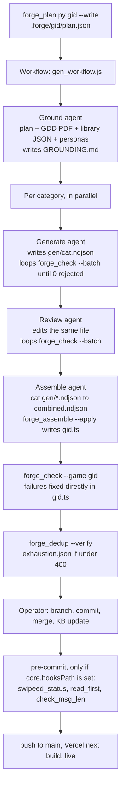

# SwipeEd forge pipeline review, 2026-09-14

Read-only review under SWED-65 of the generator (`scripts/forge/gen_workflow.js`, `forge_plan.py`, `forge_assemble.py`, `DESIGN.md`) and the gates (`common.py`, `forge_check.py`, `forge_dedup.py`, `check_msg_len.py`, `read_first.py`, `swipeed_status.py`, the pre-commit hook, `test_gates.py`), at commit `de7944d`. The content itself is reviewed in the [question bank audit](question-bank-audit-2026-09-14.md); the data format and gate table are in the [question bank](../schemas/question-bank.md) doc.

## Summary

- **The shipped bank passes its own gates today.** `forge_check.py` passes 69 of 69 games, `check_msg_len.py` and `test_gates.py` pass, and the content audit found no broken answer keys. The problems are in what the pipeline would let through next time.
- **No gate runs by default.** Hooks work only in a clone where someone set `core.hooksPath`, there is no CI, and Vercel runs a plain `next build`. The shape, duplicate and claim checks never run at commit even when hooks are on.
- **Claims were never verified.** The design's web-validation step was never built, the claim sniffer is not part of the checks that run on shipped files, and evidence notes are thrown away at assembly.
- **The next regrowth run could silently overwrite shipped scenarios**, because ids are not allocated against the existing bank and assembly treats any matching id as a reshape.
- **The review agent is not independent** and does not check most child-safe-content rules.
- `DESIGN.md` describes guarantees the code does not provide.

## How it actually runs

## Findings: generator

| Id | Severity | Finding | Evidence | Fix |
|---|---|---|---|---|
| P1 | high | Factual and legal claims were never verified. DESIGN.md promises web validation of flagged claims; nothing does it. The batch gate only requires an `_evidence` field to exist, written by the generating agent, and assembly strips it, so no evidence survives. The content audit then found a law that changed underneath the content. | `forge_check.py:61-64`; `forge_assemble.py:16`; `DESIGN.md:34` | Commit an evidence ledger per game (claim, source URL, date, verifier); add a verification step; re-verify on a schedule. |
| P2 | high | A regrowth run can silently overwrite shipped scenarios. Ids are `900 + i*90` per category whatever the bank already holds; the batch gate never checks ids; assembly replaces any line whose id matches. Every grown game already uses ids 900 to 1439. | `gen_workflow.js:107,115-116`; `forge_check.py:44-72`; `forge_assemble.py:60-63` | Allocate ids above the bank's highest id in `forge_plan.py`; reject batch ids that already exist unless on the reshape worklist; make assembly refuse other replacements and keep `type` and `cat` unchanged. |
| P3 | high | Id blocks are not enforced, which is how SWED-54 happened: generators count "upward" with no limit. | `.forge/lead-the-way/gen/the-gaps.ndjson` runs to 997 inside 900-989; `.forge/mutual/gen/mutual-respect-equal.ndjson` to 995 | Enforce the block and check duplicates across batches before combining. |
| P4 | high | The review agent is neither independent nor complete: same model and agent type as the generator, reads the keys before "re-deriving" them, names 5 mechanics in its key check, and has no checks for self-disclosure invitations, confidentiality promises, disclosure responses, safe messaging, legal traps for minors, the clinical-content boundary or outing risk. Its edits are not reviewed. | `gen_workflow.js:136-151` | Blind key derivation (strip `best`, `trick` and `key`, derive, diff by script); a checklist from child-safe-content; a stronger or different review model; persist the review diff. |
| P5 | high | Merge-gate fixes bypass the pipeline: the assemble agent edits the shipped `.ts`, nothing writes back and no reviewer sees the change. | `gen_workflow.js:162-165` | Fix in the NDJSON and re-run assembly, which should be idempotent. |
| P6 | high | Each game's helpline string is taken from its GDD PDF, not a verified source. | `gen_workflow.js:99` | A versioned helpline registry with sources and verification dates, and band-aware routing rules. |
| P7 | medium | No voice rules in the prompt and no dash check in any gate. | `gen_workflow.js:15-37` | Voice rules in the prompt; reject U+2013 and U+2014 in visible fields for new content. |
| P8 | medium | Shape guidance covers 8 of 10 mechanics (no `swipe`, no `explore-label`). | `gen_workflow.js:15-37` | Add both. |
| P9 | medium | Exhaustion is self-certified; the gate accepts any `exhaustion.json`. | `gen_workflow.js:123-125,168-170`; `DESIGN.md:45-47` | Compute a diversity metric by script and require it. |
| P10 | medium | TypeScript is never run; the assemble agent asserts it is unaffected. | `gen_workflow.js:171-172` | Run `npx tsc --noEmit` or `npm run build`. |
| P11 | medium | The planner degrades silently: library parse errors are swallowed, categories come from existing scenarios instead of the declared list, quotas scale the current reflect-heavy mix. | `forge_plan.py:24-29,45-49,54-62,69-77` | Fail on errors; plan from declared categories and to the mix caps. |
| P12 | medium | The repo path is hardcoded, so a run from a git worktree writes into the main checkout. | `gen_workflow.js:13` | Take the path from args or the working directory. |
| P13 | medium | No run record survives; `.forge/` is gitignored and the workflow result is not saved. | `gen_workflow.js:177`; `.gitignore:50` | Write `.forge/<gid>/run.json` and a log summary. |
| P14 | medium | Assembly writes the game file before parsing it and leaves a broken file on failure. | `forge_assemble.py:70-74` | Temp file, parse, atomic replace. |
| P15 | medium | Unrecognised lines are skipped, not rejected, in the batch gate and in assembly. | `forge_check.py:54-55`; `forge_assemble.py:33` | Reject every non-empty unrecognised line. |
| P16 | low | No model or effort pinning beyond `effort: 'high'` on assemble. | `gen_workflow.js:103,135,151,175` | Pin generation and review models. |
| P17 | low | Grounding finds its documents by glob; `read_first.py` already resolves and hash-pins them. | `gen_workflow.js:95-96` | Pass the paths from `read_first.py --require`. |
| P18 | low | `DESIGN.md` describes a different pipeline (table below). | `DESIGN.md` | Rewrite it to match the code, or implement the gaps. |

## Findings: gates

Found with 20 adversarial probes against the gate functions (probe scripts kept with the SWED-65 working files); 10 further probes behaved as documented.

| Id | Severity | Finding | Evidence | Fix |
|---|---|---|---|---|
| G5 | critical | Every gate is opt-in and none runs before deploy. `core.hooksPath` is never set automatically (no `prepare` script), there is no CI, and Vercel runs a plain `next build`. | A fresh clone committed a wrong and a retired helpline with no gate output; the same clone with hooks enabled blocked a violation | Add `"prepare": "bash scripts/setup-hooks.sh"`; run the gates as a CI check or Vercel build step. |
| G1 | high | The law and statistic sniffer (`claim_flags`) is never part of `scenario_errors`, which every real gate calls; it only runs in batch mode during generation. | `common.py:458-468,478-488`; a fabricated "Section 375 protects every child, always" returns no errors | Call it from `scenario_errors` and at commit. |
| G4 | high | Helpline checks at commit cover only the four config strings, not scenario prose. | `check_msg_len.py` scenario loop; "Childline: 112" in a `hook` passes | Run `helpline_errors_text` on every scenario field at commit. |
| G6 | high | Nothing checks that a bank is non-empty. | A game file with full config but `SCENARIOS = []` passes `check_msg_len.py` | Add a minimum-count check at commit. |
| G2 | high | The commit-time length gate keeps its own incomplete field list and misses reflect options, sort items, match pairs, explore-label reveals and swipe cues. | 5 of 5 over-length fields missed; `common.field_len_errors` catches all | Call `common.field_len_errors`. |
| G7 | high | Helpline binding misses possessive and parenthetical phrasing. | "Childline's number is 112" and "Childline (112)" pass | Widen separators or match the nearest number. |
| G8 | high | The retired-KIRAN check (added in SWED-62) is case-sensitive and literal, so "Kiran helpline", "K.I.R.A.N." and zero-width characters evade it. | Probe outputs | Case-insensitive match with a helpline-context guard; strip zero-width characters first. |
| G10 | high | Duplicate ids are checked only within one file. | Two games sharing `shared-777` report no collision | A fleet-wide id check. |
| G3 | medium | Role-play has no shape validator, so zero or two `best` lines pass. No live cases today. | `shape_errors` has no role-play arm | Require exactly one `best`. |
| G9 | medium | Build `sequence` keys are compared as sets: a reversed or incomplete order passes. No live cases found in a sample. | Reversed key returns no errors | Validate an ordered key. |
| G11 | medium | The reflect "no best/key/trick" check is dead code. | `common.py:357-360` | Make it append an error. |
| G12 | medium | The 0.82 prose-dedup threshold depends on surrounding prose, so the same one-word swap is blocked in a long reflect (0.917) and missed in a short swipe (0.806). | Probe outputs | A lower threshold for short mechanics or a fixed window. |
| G13 | medium | A correct number in Devanagari digits is flagged as wrong. | Probe outputs | Normalise digits before comparing. |
| G14 | medium | Extra spaces inside a correct number cause a false failure. | Probe outputs | Strip whitespace first. |
| G15 | medium | The US-framing list misses "9 1 1" and colloquial terms such as "mom", "cops" and "ER". | Probe outputs; Indian equivalents correctly pass | Extend the list. |
| G16 | medium | The sniffer misses digit-free claims such as "Half of all reported cases". | Probe outputs | Add quantifier phrases, with G1. |
| G17 | medium | `--game` takes the filename stem, not the `gameId` (`feelings-friends.ts` has gameId `feelings`), and dedup reports "clean" when it matches nothing. | `forge_check.py --game feelings` fails | Resolve gameIds and error on zero matches. |
| G18 | medium | `check_msg_len.py` silently skips unparseable scenario lines. | `check_msg_len.py:124-131` | Reuse `common.parse_file`. |
| G19 | low | Compound emoji and unnormalised text make field lengths inconsistent. | Family emoji counts as 7 | Count grapheme clusters or normalise to NFC. |
| G20 | low | The "middle school ... in India" exception matches one exact phrase. No live cases. | Probe outputs | Broaden it. |

Checks that worked as documented: sort unused bins and missing keys, match duplicate rights and left-equals-right, spot trick counts, swipe valence, explore-label answers, branch double best, the all-caps KIRAN check, "Kiran" as a character name, literal 911 and "Grade N", within-file duplicate ids, and a synonym swap in a long scenario.

## What runs at commit and deploy

| Change | Gates that run (hooks enabled) | Gates that never run |
|---|---|---|
| Hand edit to a scenario | `swipeed_status.py --check`, `check_msg_len.py` (length, band, config helplines) | shapes, ids, dedup, scenario helplines, claims, non-empty bank |
| New game file | the above plus `read_first.py --gate` | the same |
| `helpLine` or `reassure` edit | `check_msg_len.py` helpline check on the four config fields | |
| Fresh clone, or `--no-verify` | nothing | everything |
| Push to `main` | Vercel `next build` (TypeScript) | every content gate |

## Test gaps

`test_gates.py` covers required fields and the retired-helpline check only. Nothing tests shape validators, helpline binding, the US list, the claim sniffer, length and band checks, membership, dedup, `forge_check.py` or assembly. The smallest useful set: a pass and fail fixture per mechanic for `shape_errors`; possessive, sentence-case, dotted and Devanagari helpline cases; a spaced 911 case with an Indian control; a claim fixture plus a canary that `scenario_errors` calls the sniffer; intra-band, threshold-boundary and cross-file id fixtures; an empty-bank fixture.

## Baseline, 2026-09-14

- `forge_check.py --game` for all 69 games: 69 pass, 0 fail (0 parse errors, 0 shape, helpline, length, band, membership or mix failures; only the two logged sub-400 games).
- `check_msg_len.py`: pass. `test_gates.py`: pass.
- `forge_dedup.py --verify` for all 69 games: 69 pass, 0 intra-band collisions (about 30 seconds per game with the real CLI).

## DESIGN.md versus the code

| DESIGN.md promise | Status | Evidence |
|---|---|---|
| Tripwires force extra review for safeguarding categories, young bands and dup clusters | Not implemented | `gen_workflow.js:136-151` |
| Each batch gets a forced mechanic from the remaining quota | Partial: "up to" quotas | `gen_workflow.js:114` |
| `_evidence` and `_anchor` sidecars | Presence only; stripped at assembly | `forge_check.py:61-64`, `forge_assemble.py:16` |
| Regeneration bounded at one bounce, else drop | Not implemented | `gen_workflow.js:131-133,148-149` |
| Web validation of flagged claims | Not implemented | none |
| `read_first --attest-expansion` in grounding | Not implemented | `gen_workflow.js:93-103` |
| `parsed_count == intended_count` assertion | Not implemented | `forge_assemble.py:72-75` |
| Merge gate as a pre-commit chain | Not implemented | `scripts/githooks/pre-commit` |
| Exhaustion agent plus diversity metric | Not implemented | `gen_workflow.js:123-125,168-170` |
| Periodic re-validation of the helpline and law allowlist | Not implemented | `common.py` |
| Seven named scripts | Consolidated into `common.py` and `forge_check.py` | `scripts/forge/` |
| Structural-signature dedup with intra-band blocking | Implemented | `forge_dedup.py` |
| Band-aware mechanic allowlist | Implemented | `forge_plan.py:51` |
| Legacy reshape worklist | Implemented | `forge_plan.py:83-92` |

## Recommended order of work

1. **Make the gates run.** A `prepare` script for hooks, and a CI or Vercel step that runs `forge_check.py` for changed games, the length and helpline checks on every field, a non-empty check and a fleet-wide id check before deploy (G5, G4, G6, G2, G10).
2. **Make regrowth safe** before anyone grows a bank again: id allocation, no silent overwrite, rejected unrecognised lines, atomic assembly (P2, P3, P14, P15).
3. **Verify claims:** the sniffer in `scenario_errors`, an evidence ledger, a helpline registry with verification dates, widened helpline matching (G1, P1, P6, G7, G8, G16).
4. **Independent safety review:** blind key derivation and a child-safe-content checklist in the review step (P4).
5. **Close validator gaps:** role-play, build order, reflect, dedup threshold, digits and spacing (G3, G9, G11, G12, G13, G14, G15, G17, G18).
6. **Voice and coverage:** dash gate, swipe and explore-label shapes (P7, P8).
7. **Hygiene:** fixes flow back through the NDJSON, TypeScript in assembly, repo path, run record, model pinning, planner errors, exhaustion metric, tests, and a `DESIGN.md` that matches the code (P5, P9 to P13, P16, P17, P18, test gaps).

## Follow-up tickets

Proposed with this review and filed on 2026-09-15.

| Priority | Ticket | Covers |
|---|---|---|
| Urgent | [SWED-72](https://app.plane.so/the-equal-lens/projects/59d0b01f-352e-4aee-bd3f-252cdf283a74/issues/6d8a2d7c-843d-4058-964b-83f8181fc21b) Run content gates automatically before every deploy | G5, G4, G6, G2, G10 |
| High | [SWED-73](https://app.plane.so/the-equal-lens/projects/59d0b01f-352e-4aee-bd3f-252cdf283a74/issues/9c4f8ab8-948f-4898-b536-457b25d11d71) Make forge regrowth safe (ids, overwrite, assembly) | P2, P3, P14, P15 |
| High | [SWED-74](https://app.plane.so/the-equal-lens/projects/59d0b01f-352e-4aee-bd3f-252cdf283a74/issues/1de71970-d924-45d7-acb9-3c28e8a33126) Verify claims: sniffer at commit, evidence ledger, helpline registry | G1, P1, P6, G7, G8, G16 |
| High | [SWED-75](https://app.plane.so/the-equal-lens/projects/59d0b01f-352e-4aee-bd3f-252cdf283a74/issues/9a72838c-0fcd-4100-bf57-7d6885f65d2d) Independent, checklist-driven safety review in the forge | P4 |
| Medium | [SWED-76](https://app.plane.so/the-equal-lens/projects/59d0b01f-352e-4aee-bd3f-252cdf283a74/issues/87cb9b6b-551a-4c34-a209-514be826753b) Close shape and matching validator gaps, with tests | G3, G9, G11 to G15, G17, G18, test gaps |
| Medium | [SWED-77](https://app.plane.so/the-equal-lens/projects/59d0b01f-352e-4aee-bd3f-252cdf283a74/issues/d29a10b8-b2e1-4f02-8710-0de2de4f36de) Voice gate and full mechanic coverage in the generator | P7, P8 |
| Low | [SWED-78](https://app.plane.so/the-equal-lens/projects/59d0b01f-352e-4aee-bd3f-252cdf283a74/issues/34d7b4f6-4d2e-42ea-ada9-0f75a297bc52) Forge hygiene and a truthful DESIGN.md | P5, P9 to P13, P16 to P18 |
